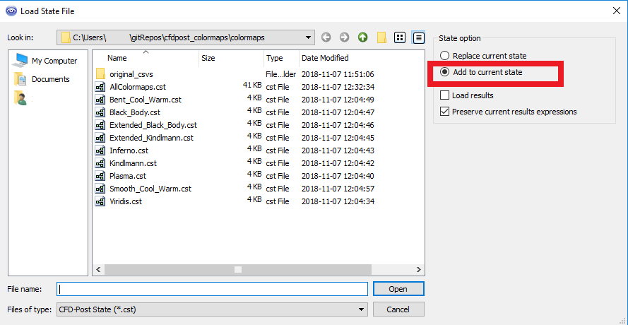

# cfdpost_colormaps
#### Working in ANSYS Fluent? Check out [fluent_colormaps](https://github.com/u2berggeist/fluent_colormaps)!
#### Work with `.ccl`'s and `.cst`'s? Check out my VS Code Extension for Language Support, [ANSYS CFX](https://marketplace.visualstudio.com/items?itemName=u2berggeist.cfxlanguage)!

Here are tools that allow users to use different color maps in ANSYS CFD Post without having to enter then in manually or have them buried in a `.cst` file.

The example colormaps are taken from [Kenneth Moreland's webpage](https://www.kennethmoreland.com/color-advice/) on color map advice*. These colormaps are generally recommended over the default ones available in CFD Post.

I've also written up a simple Python script that will translate CSV's into the correct format for this process. It is commented with instructions.

\*Note that the "Extended Black Body" colormap used to be posted on Kenneth's website. It is no longer there and is replaced by the "Inferno" colormap. The "Extended Black Body" and "Inferno" are not quite the same, with "Inferno" being more muted in it's color pallette which I personally don't like. I'm currently (2018-11-07) contacting Kenneth to get his comment on the matter.

## Use:
Simply import the `.cst` with the colormap of your liking to use it, or import `AllColormaps.cst` to get all of them. 

To get the files, you can either clone the repository, download the repository as a zip, or just download the individual `.cst` files you need. 

#### WARNING: If you do not have "Add to existing state" selected in the loading state dialog box in CFD Post **YOU WILL LOSE YOUR WORK**. Remember, when in doubt, save before doing anything else.

## Color Map Format:

Above is an example of the general format for the `.cst` files. (Syntax highlighting provided by [ANSYS CFX](https://marketplace.visualstudio.com/items?itemName=u2berggeist.cfxlanguage) VS Code Extension)

#### `COLOUR MAP`:
This is simply the header for the colormap section of the `.cst` The word to the right of the ':' is the display name of the colormap.

#### `Colour Map Colours`:
Simply a list of all the color map points. There are 5 floats per color point: fraction value, percentages for Red, Green, and Blue respectively, and then the transparency percentage. My current translation script makes transparency equal to 1 for all (so completely opaque).

#### `Colour Map Divisions`:
No idea what this does. All of the default maps have it set to 2, so I followed suit.

#### `Colour Map Storage Type`:
Not quite sure what exactly this one does either. From what I can tell, it simply specifies whether it is a default ANSYS colormap or a custom one. Why ANSYS can't just let the header be the determining factor on that is beyond me.

#### `Colour Map Type`:
Specifies that the map is a gradient between different color points. This as opposed to zebra type color map.